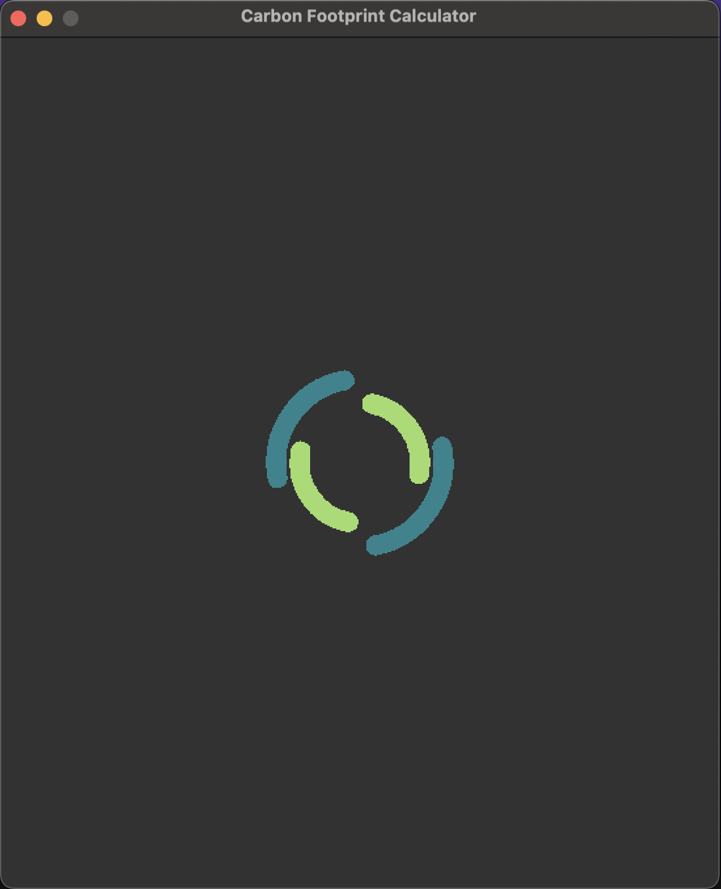
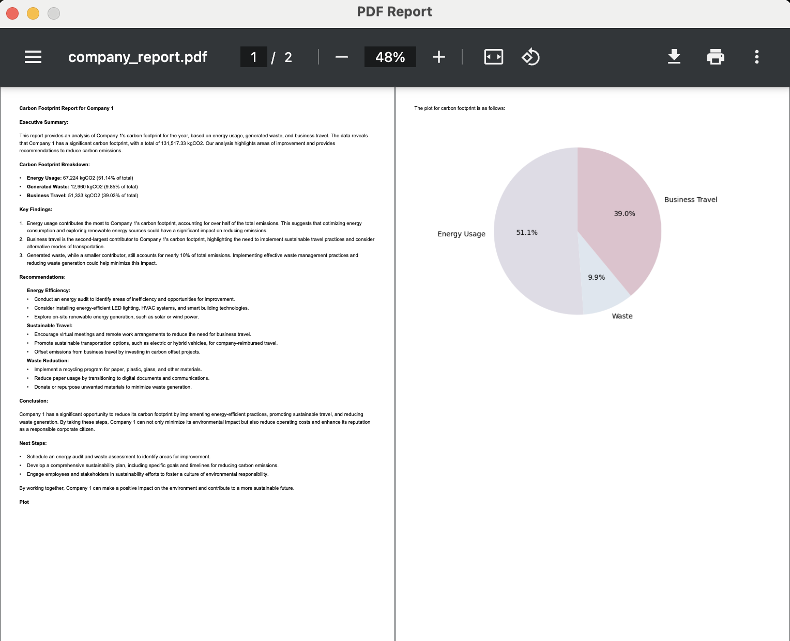

# **Carbon Footprint Calculator**

[](https://www.python.org/downloads/release/python-3130/)
[](https://pypi.org/project/PyQt6/)

## What is Carbon Footprint Calculator

This is a sample project related to the Computer Programming course at Gisma University of Applied Sciences.
In this project, I developed an application using <b>Python</b>, and for the GUI part, I used <b>PyQt6</b>, which
is a framework for building GUI applications in Python. The project allows users to input various parameters
related to the usage of <i>Energy</i>, <i>Waste</i>, and <i>Business Travels</i> for a company. Finally, a pie chart
is generated, and a report comparing the mentioned parameters is created using an external LLM.
The full technical report can be found in the docs folder.

## Try out Carbon Footprint Calculator

To run application make sure the `python==3.13` is installed, also it is recommended to use `virtualenv` for installing
requirements.

For installing requirements just execute the following command :

```bash
pip install -r requirements/requirements.txt
```

To communicate with external LLM, you need an API key which can be obtained from
<a href="https://openrouter.ai/settings/keys">openrouter.ai</a>, however I will send my API key when submitting the
assignment.
The application read the API key from an environment variable named `OPEN_ROUTER_API_KEY`.

To set the API key just execute the following command in terminal:

```bash
export OPEN_ROUTER_API_KEY=YOUR_API_KEY
```

Finally, the application can be run using these commands, make sure to cd in the `carbon_footprint_calculator` folder to 
prevent from mixing `PYTHON_PATH`.
```bash
cd carbon_footprint_calculator
python app.py
```

## Application Demo
In this section you can find some screenshots related to this application.





## Test
To have a better application, writing test is crucial. In python, it is common to use `pytest` for writing test to avoid unseen
circumstances. There are different stages of test, which in this application `unit` and `integration` exist. To run the test 
following these steps. Just beware of setting proper environment variables for connecting to external LLM.

```bash
# Install test requirements
pip install -r requirements/requirements_test.txt
# Run test with pytest
pytest
```

The result of tests would be like the following image:


## License

This project is licensed under the [MIT License](LICENSE).  
You are free to use, modify, and distribute this software as long as you include the original copyright and license notice.
